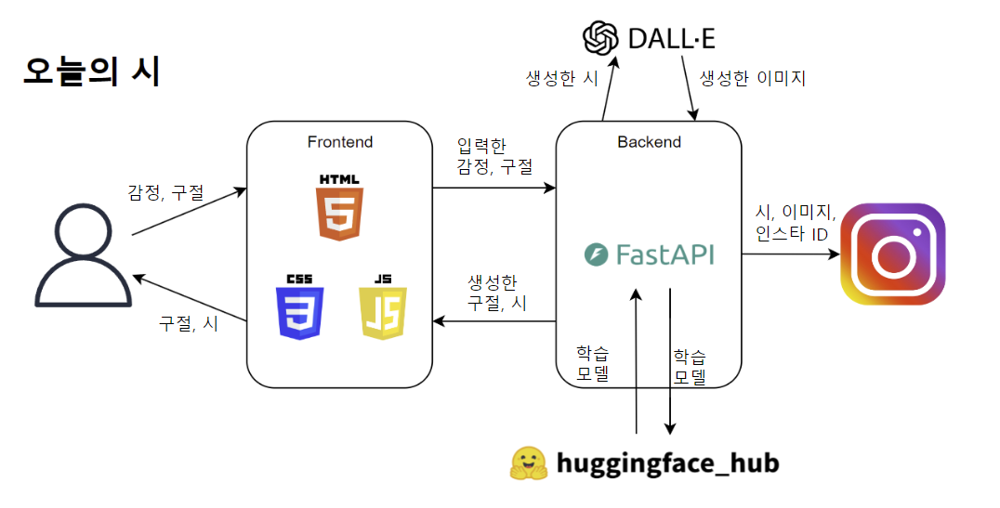

# 오늘의 시

사용자의 감정을 물어보고 이를 활용해 시와 이미지를 생성하는 웹 서비스입니다. 이를 통해 자신의 감정을 풍요롭게 표현해보고, 문학적 표현을 통해 느끼는 감정을 더 깊게 이해할 수 있습니다. 그리고 SNS에 자신의 시와 이미지를 쉽게 공유해보며 서로의 생각을 나눠볼 수 있습니다.

인스타그램 공식 계정 [오늘의 시(@poemoftoday)](https://www.instagram.com/poemoftoday)에 게시물이 업로드됩니다.

__서비스 주소 :__ http://www.poemoftoday.shop

## 프로젝트 타임라인

## 팀원 소개
- 김기호_T6013 : 문장 데이터 생성, 문장 생성 모델 학습, Frontend
- 박상기_T6057 : 문장 데이터 생성, Frontend
- 심재혁_T6093 : 문장 데이터 생성, Backend, 배포
- 김건우_T6197 : 시 데이터 크롤링 및 전처리, 시 생성 모델 학습

## 서비스 구조 및 기능

### 1. 문학적 표현 문장 생성
- 사용자가 선택한 감정을 기반으로 문학적 표현이 담긴 문장을 생성합니다.
- 선택할 수 있는 감정은 크게 5가지로 각 카테고리에 4개의 단어가 존재합니다.
- 총 3개의 문장을 생성하며, 사용자는 1개를 선택할 수 있습니다.
    - 기쁨 : "기쁘다", "즐겁다", "감사하다", "행복하다"
    - 설레임 : "수줍다", "부끄럽다", "쑥쓰럽다", "민망하다"
    - 슬픔 : "슬프다", "서럽다", "속상하다", "우울하다"
    - 그리움 : "그립다", "공허하다", "외롭다", "후회스럽다"
    - 불안 : "두렵다", "불안하다", "초조하다", "혼란스럽다"

### 2. 시, 이미지 생성
- 위에서 생성한 문장을 첫 행으로 하는 시를 생성합니다.
- 시를 생성할 때, 시의 구조와 전체적인 주제 흐름을 고려합니다.
- 그림은 첫 행에서 드러나는 감정과 분위기를 기반으로 생성됩니다.
- 그림체는 수채화를 사용합니다.

### 3. SNS 공유
- 생성된 시와 이미지를 인스타그램에 공유할 수 있습니다.
- 저희 프로젝트 공식 계정 "오늘의 시"에 게시물이 업로드됩니다. 
- 공유할 때, 사용자의 인스타그램 ID를 입력해야하며 이는 게시물의 태그로 지정됩니다.
- 입력하신 인스타그램 ID가 존재하지 않는 경우에는 업로드할 수 없습니다.

## 로컬 실행방법
1. 라이브러리 설치
    - 아래의 명령어를 사용해 라이브러리를 설치합니다.

            pip install -r requirements.txt

2. app.py 실행 
    - 아래의 명령어를 사용해 서버를 실행합니다.
        
            cd Application/
            python3 app.py 